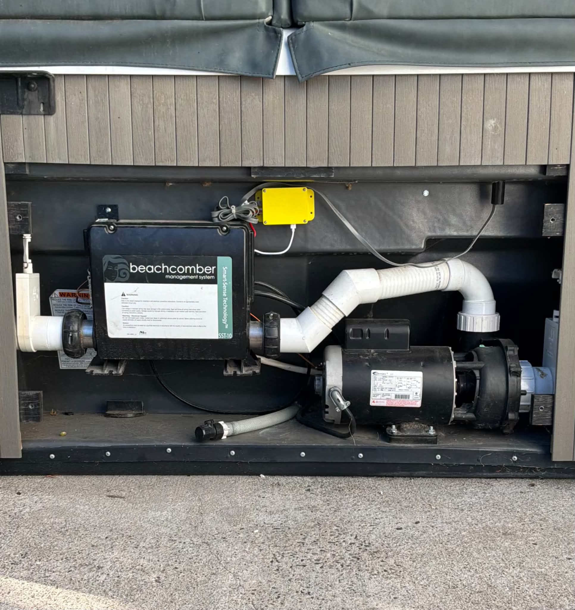
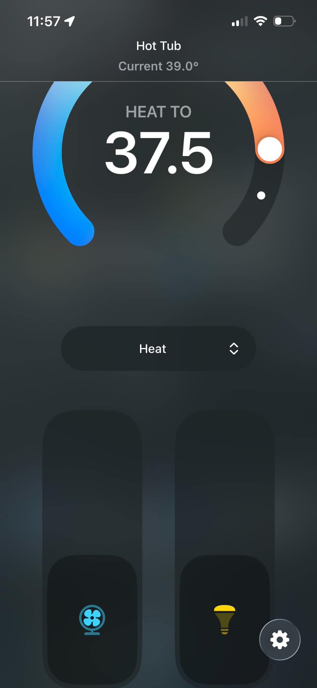

# Balboa VL400 ESP32

<p align="center">
  
</p>

## Description

This project adds Wi-Fi functionality to hot tubs that use the Balboa 4-button topside controller with this layout: Temp, Blower, Jets, and Lights. The Wi-Fi hardware is based around an ESP32/ESPHome interface developed by Kevin Storm (kgstorm) for the original project.

Home Assistant is used to monitor the hot tub's temperature, set temperature, heating mode, heater status, pump status, filter settings, and other information decoded from the VL400 topside display. It also provides remote control of the physical topside functions and automated temperature setting.

This fork has been developed and tested on a 2019 Beachcomber 654 LEEP using a Balboa VL400/Beachcomber ET-50 topside controller. Compatibility with other Balboa/Beachcomber control systems using similar topside hardware is possible but has not been verified.

---

### Original Project

As mentioned, this project is based on the original **Balboa-GS5xx** project by Kevin Storm (kgstorm). The original project provided the ESP32 hardware interface, display decoding, ESPHome integration, PCB design, wiring documentation, and Home Assistant frontend that formed the foundation for this fork. Many many many thanks to Kevin for everything he contributed!

This fork extends his work with additional VL400-specific functionality, including filter-cycle duration (F2/F4/F6/F8/FC) and frequency (2C/1d/1n) control, improved temperature-setting logic, additional state decoding, and functional and quality-of-life enhancements to the Home Assistant integration and custom card.

---

## Hardware Purchase Option

 From the original project, Kevin has modules available for purchase. If interested, please email him at kevin.storm@gmail.com.

---

## PCB and Project Box Fabrication

The PCB and Project Box files from the original project are located in the Production directory. These were designed and provided by Kevin Storm as part of the original Balboa-GS5xx project.

Kevin used JLCPCB to order the original PCBs, while I opted to use PCBWay due to their lower price ($5 for 5 PCBs, shipping included!). The provided production files can be used to order compatible PCBs from either service or another PCB manufacturer.

---
## Software Installation

1. Copy the `esp32-spa.yaml` file and the entire `esp32-spa` folder into your Home Assistant config folder under the `esphome/` subfolder. The folder layout should look like:


```
config/
└── esphome/
    ├── esp32-spa.yaml
    └── esp32-spa/
        ├── __init__.py
        ├── binary_sensor.py
        ├── esp32-spa.h
        ├── sensor.py
        └── text_sensor.py
```

2. Edit the UNITS key in `esp32-spa.yaml` to set the desired temperature units.

3. In Home Assistant go to **ESPHome**, click **New Device** → **Import From File**, and select `esp32-spa.yaml`.

4. `esp32-spa.yaml` will also look for a `secrets.yaml` file inside the **esphome/** folder for the following keys: `api_key`, `wifi_ssid`, `wifi_password`, `ota_password`, and `ap_password`.

---

## Wiring

- An attempt was made with an ESP8266, but the Wi‑Fi and ISR requirements (or pin/boot choices) caused persistent boot issues, so the project uses an ESP32 which worked reliably.
- The 4 buttons on the GS5xx topside panel act like switches that connect to 5V when pressed, but when not pressed show ~2.5V. To avoid interfering with the panel we used optocouplers to reproduce the switch signals safely.
- For the data and clock lines we use a simple voltage divider (2.2k and 4.7k) to reduce the voltage down to ~3.4V, then add a 220Ω series resistor to the ESP32 GPIOs.

Wiring Diagram:


ESP32 DEVKIT V1 GPIO assignments:

| Spa RJ45 pin | Function | Wiring diagram color | GPIO pin |
|---:|---|---|---|
| 1 | VIN | red | VIN |
| 2 | Light Button | orange | 25 |
| 3 | Jets Button | purple | 27 |
| 4 | GND | black | GND |
| 5 | Display Data | green | 34 |
| 6 | Clock | yellow | 35 |
| 7 | Blower Button | blue | 32 |
| 8 | Temp Button | lime green | 26 |

**ESP32 Power:** The ESP32 requires a stable 5V power supply. One issue I ran into was that the in-line power supplied to the VL400 was insufficient to power the ESP32, so a separate 5V source had to be added. The Balboa control board in my hot tub has two separate 120V rails with several open connection points that can provide constant 120V power, as well as connection points for neutral. I used these to power a 120V-to-USB mains power converter, which allowed a USB cable to be run directly to the ESP32. Since USB became the primary power source for the board, I removed the VIN pin from the ESP32, allowing it to receive power separately from the topside controller.

Other installations may differ, so please use an appropriate power source for your application. As a safety note, I am not an electrician, and you probably aren't either. This is the way I chose to provide a dedicated 5V supply to the ESP32, and it worked pretty well for me. Working with 120V power can be dangerous, so please proceed carefully or, if you are unsure, consult a qualified electrician who may be able to help.

---

## Frontend

This repository includes a Home Assistant custom card for controlling and monitoring the spa. To install the frontend component:

1. Copy `dist/spa-control-card.js` from this repository into your Home Assistant `www/` folder (e.g., `config/www/spa-control-card.js`).
2. Open the dashboard where you want to add the card, click the three-dot menu (upper-right), and select **Manage resources**.
3. Click **Add resource**, set **URL** to `/local/spa-control-card.js` and **Resource Type** to `JavaScript Module`, then save.
4. Add the card to your dashboard via **Add Card** → search for **Spa Control Card**. The card includes a graphical configuration editor, or it can be configured using raw YAML.
5. For **Device Name**, enter the name of your ESPHome device. Given the device name, the frontend automatically discovers the required entities.

```yaml
type: 'custom:spa-control-card'      # required
device_name: 'hot_tub'               # required - ESPHome device name used to discover the spa entities.
title: 'Hot Tub Control'             # optional - Card title.
high_setting: true                   # optional - Show/hide the High temperature preset button. Default is true.
low_setting: true                    # optional - Show/hide the Low temperature preset button. Default is true.
show_aux_button: false               # optional - For tubs equipped with Aux/Turbo functionality. Default is false.
show_mode_buttons: true              # optional - Show/hide Economy/Standard/Sleep buttons. Default is true.
```

The High and Low temperatures themselves are configured through the Spa High Temperature and Spa Low Temperature entities provided by ESPHome rather than being specified in the card configuration.

If the card doesn't appear immediately, try a hard-refresh (Ctrl/Cmd+Shift+R) or clear the browser cache.


---

## Error Codes

- This integration exposes a `text_sensor` for error codes (`sensor.<device name>_spa_error_code`). The text sensor shows the 2‑character code from the topside display and a friendly translation when available, for example:

  - `HH - high overheat (water temp over 118 F)`

---

## Home Assistant Entities

The device exposes the following entities in Home Assistant:

- `sensor.<device_name>_spa_measured_temp` — current water temperature
- `sensor.<device_name>_spa_set_temp` — current set temperature
- `binary_sensor.<device_name>_spa_heater_status` — heater on/off
- `binary_sensor.<device_name>_spa_pump_status` — pump/jets on/off
- `binary_sensor.<device_name>_spa_light_status` — light on/off
- `text_sensor.<device_name>_spa_error_code` — current error code with friendly translation
- `text_sensor.<device_name>_spa_mode` — current heating mode (`Standard`, `Economy`, `Sleep`)
- `select.<device_name>_spa_filter_duration` — filter cycle duration (`F2`, `F4`, `F6`, `F8`, `FC`)
- `select.<device_name>_spa_filter_frequency` — filter cycle frequency (`2C`, `1d`, `1n`)
- `select.<device_name>_spa_display_unit` — temperature unit selector (`°C` / `°F`)
- `select.<device_name>_spa_heating_mode` — heating mode selector (`Standard`, `Economy`, `Sleep`)
- `number.<device_name>_spa_high_temperature` — configurable High temperature preset
- `number.<device_name>_spa_low_temperature` — configurable Low temperature preset
- `button.<device_name>_spa_temp` — virtual Temp button press
- `button.<device_name>_set_spa_high` — apply the configured High temperature preset
- `button.<device_name>_set_spa_low` — apply the configured Low temperature preset
- `button.<device_name>_spa_lights` — virtual Lights button press
- `button.<device_name>_spa_jets` — virtual Jets button press
- `button.<device_name>_spa_blower` — virtual Blower/Aux/Turbo button press
- `button.<device_name>_esp_restart` — restart the ESP32

### Filter Cycle Settings

The VL400 stores filter duration and filter frequency as two separate settings:

- **Duration:** `F2`, `F4`, `F6`, `F8`, or `FC` correspond to 2, 4, 6, 8, or 12 hours per filter cycle.
- **Frequency:** `2C` runs two filter cycles per day, `1d` runs one daytime cycle per day, and `1n` runs one nighttime cycle per day.

These settings are read directly from the topside controller and can also be changed through Home Assistant.

### Example Home Assistant automation (mobile push notification)

Trigger a mobile push when a new error code appears (replace `notify.mobile_app_YOUR_DEVICE_NAME` with your device):

```yaml
alias: "Spa Error Notification"

triggers:
  - platform: state
    entity_id: sensor.hot_tub_spa_error_code

condition:
  - condition: template
    value_template: >
      
      {{ s not in ['', 'unknown', 'none', 'unavailable'] }}

action:
  - service: notify.mobile_app_YOUR_DEVICE_NAME
    data:
      title: "Spa Alert"
      message: "{{ states('sensor.hot_tub_spa_error_code') }}"

mode: single
```

## Measurements

- Each display frame consists of 4 packets of data: three packets of 7 bits and a final packet with 3 bits.

- Packet 1 (bits referenced MSB→LSB as 6 5 4 3 2 1 0):
  - Bits 5 and 4 HIGH indicate a `1` in the hundreds digit (Fahrenheit display).
  - Bit 2 is the heater status (when the heater is active, this bit pulses).

- Packets 2 & 3: used for the display characters where each bit maps to a segment of the 7-segment display. Here is the bit mapping (MSB→LSB):

```
Bit -> Segment
6   = top
5   = top-right
4   = bottom-right
3   = bottom
2   = bottom-left
1   = top-left
0   = center
```

- Given the above bit mapping, the number 7 would illuminate the top, top-right, and bottom-right segments, so those bits would be HIGH and the packet would look like this: 1110000.

- Packet 4 (3 bits):
  - Bit 2 = pump status
  - Bit 1 = light status

 - The remaining bits always appear LOW in my observation. I use them as a frame checksum. They are: Packet 1 bits 6, 3, 1, 0 and Packet 4 bit 0 (MSB to LSB).


- Timing observations (from logic analyzer):
  - Clock pulses: ~16 µs ON with ~21 µs gap between pulses.
  - Data pulses: ~17.5 µs with ~20 µs gap; data is sampled on the rising edges of the clock.
  - Each frame consists of 24 bits (4 packets of 7 bits, 7 bits, 7 bits, and 3 bits)
  - Between each frame is a LOW segment of ~19ms.

Logic analyzer screenshot:
- In the screenshot below, the top signal is the data signal and the bottom is the clock.
  - Packet 1 (bits 6543210)
    - bit 6, 1, 0 LOW: used as a checksum (always LOW)
    - bit 5, 4 LOW: indicates the hundreds digit of the display will be blank
    - bit 2 HIGH: indicates the heater is on
  - Packet 2 (bits 6543210)
    - bit 6, 5, 4 HIGH: Translates into the number 7
  - Packet 3 (bits 6543210)
    - bit 6, 5, 4, 1, 0 HIGH: Translates into the number 9
  - Therefore the display will show the temp of 79 degrees
  - Packet 4 (bits 210)
    - bit 2 HIGH: indicates the jets (in this case the circulation pump) is on
    - bit 1 LOW: indicates the lights are off
    - bit 0 LOW: used as a checksum (always LOW)


---


## Images

### VL400 / Beachcomber Installation

The ESP32 interface installed in a 2019 Beachcomber 654 LEEP:




### Original Project Images


---

## Homebridge Integration

A companion Homebridge plugin is available for exposing the ESP32/Balboa integration to Apple Home:

[homebridge-balboa-esp32](https://github.com/sixer-fixer/homebridge-balboa-esp32)

The plugin connects to the ESPHome device and exposes the hot tub as a grouped Apple Home accessory, including temperature control, heater status, jets, and lighting.



---

## Other Balboa projects

- Balboa-GS510SZ with panel VL700S: https://github.com/MagnusPer/Balboa-GS510SZ
- GL2000 Series: https://github.com/netmindz/balboa_GL_ML_spa_control
- BP Series: https://github.com/ccutrer/balboa_worldwide_app
- GS523SZ: https://github.com/Shuraxxx/-Balboa-GS523SZ-with-panel-VL801D-DeluxeSerie--MQTT


